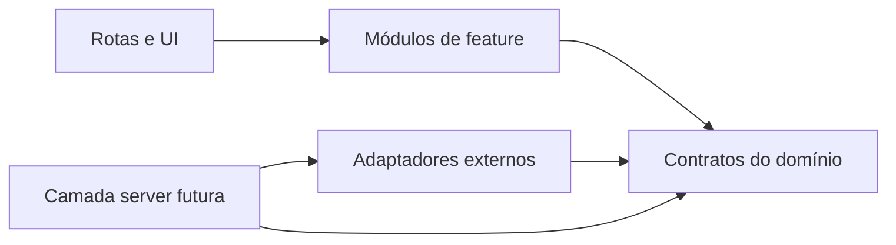

# Arquitetura modular

## Estado

Frontend aprovado e backend autorizado em fatias. Integrações reais,
infraestrutura e deploy dependem de gates próprios.

## Princípios

1. Módulos seguem capacidades do produto, não fornecedores externos.
2. UI nunca decide autorização; no produto final, servidor e banco decidem.
3. Integrações ficam atrás de adaptadores e não vazam SDKs para o domínio.
4. Dados mock do gate frontend ficam explicitamente separados de dados reais.
5. Dependências apontam da borda para contratos internos, nunca ao contrário.
6. Arquivos pequenos têm uma responsabilidade verificável.
7. Nenhuma credencial entra no repositório.

## Estrutura pretendida

```text
apps/
  web/
    src/
      app/                  rotas e composição
      features/
        home/
        products/
        ai/
        profile/
        admin/
      components/
        shell/
        ui/
      design-system/
      mocks/                somente no gate frontend
      server/               futuro; sem uso no gate frontend
  marketing/                site público e quiz
  agent/                    FastAPI privado, somente VUELVE IA
packages/
  contracts/                futuro; contratos estáveis compartilhados
  config/                   futuro; configuração comum
supabase/                   migrações, políticas e testes de banco
docs/
```

A estrutura é uma direção, não uma ordem para criar diretórios vazios.

## Módulos frontend

| Módulo | Responsabilidade | Não pode fazer |
|---|---|---|
| `home` | Hero, trilhos e composição inicial | Resolver entitlement |
| `products` | Cards, modal bloqueado, detalhe e leitor | Chamar Perfect Pay diretamente |
| `ai` | Estados bloqueado, vazio, conversa e erro | Acessar memória de outro membro |
| `profile` | Dados e preferências do membro | Alterar papel |
| `admin` | Shell administrativo e futuras operações | Aparecer para `member` |
| `shell` | Navegação responsiva e layout | Conhecer regras de pagamento |
| `design-system` | Tokens e primitivas visuais | Conter regras de negócio |
| `mocks` | Cenários estáticos explicitamente fictícios | Ser importado no backend futuro |

## Módulos backend

| Módulo | Responsabilidade |
|---|---|
| `identity` | Perfil, papel, convite, sessão e reautenticação |
| `catalog` | Produtos, capas, descrições e checkout cadastrado |
| `entitlements` | Permissões efetivas e concessões manuais |
| `content` | Itens, arquivos, leitura e downloads |
| `payments` | Eventos Perfect Pay, idempotência e reprocessamento |
| `ai-access` | Permissão, limites e configuração publicada |
| `conversations` | Histórico canônico e mensagens |
| `knowledge` | Documentos aprovados e RAG no Supabase |
| `cases` | Ciclo de vida do caso de relacionamento |
| `imports` | Recebimento privado, validação e normalização |
| `facts` | Evidências observáveis e referências de origem |
| `policy` | Consentimento, segurança, limites e decisão permitida |
| `analysis` | Análise estruturada e versionada |
| `generation` | Uso isolado do modelo após política |
| `retention` | Expiração, exclusão e expurgo entre camadas |
| `audit` | Registro imutável de ações críticas |

Esses nomes descrevem capacidades do domínio extraídas das notas Oracle; não
prescrevem tabelas, serviços ou uma aplicação Python separada. O contrato futuro
da IA está em [VUELVE IA futura](VUELVE-IA-FUTURE.md).

## Direção de dependências



- Features podem depender de primitivas do design system.
- Design system não depende de features.
- Contratos não dependem de Next.js, Supabase, Perfect Pay, Resend ou Gemini.
- Adaptadores traduzem respostas externas para contratos internos.

## Gates de implementação

1. Documentação.
2. System design e design system aprovados.
3. Frontend estático com mocks explícitos.
4. Aprovação visual e funcional do usuário.
5. Backend em fatias verticais, começando por identidade e autorização.
6. Integrações isoladas e testadas.
7. Infraestrutura, segurança, lançamento e operação.

O gate seguinte só começa quando o checklist registrar a conclusão do anterior.
