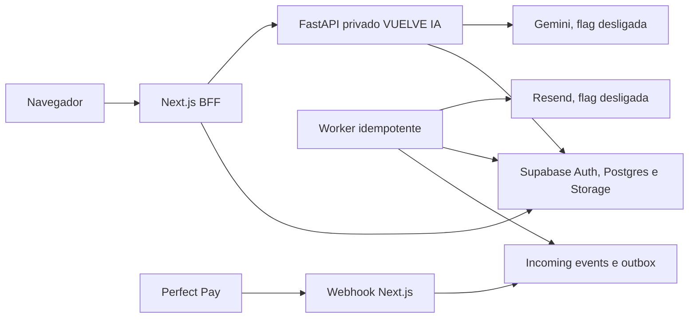

# Backend — implementação autorizada

## Estado em 30 de julho de 2026

O usuário aprovou o frontend e autorizou o backend em fatias. Esta autorização
permite código, migrações e testes locais, mas não ativa fornecedores, não cria
dados reais e não autoriza deploy público.

Implementado nesta fundação:

- governança raiz e instruções locais;
- domínio inicial de catálogo, entitlements e pagamentos no Next.js;
- Home, catálogo e detalhe resolvidos no servidor pelo catálogo ativo e pelo
  entitlement da identidade autenticada quando `FEATURE_CONTENT=true`;
- configuração validada e feature flags;
- clientes Supabase SSR/server separados;
- webhook Perfect Pay estrito, limitado e idempotente na entrada;
- projeção de pagamento, ledger SQL, RLS, conteúdo privado, outbox e auditoria;
- workers independentes para pagamento e convite, com retry e dead-letter;
- login, confirmação de convite, definição de senha e logout atrás de flag;
- troca de e-mail com prova da senha atual, confirmação nos endereços antigo e
  novo, sincronização transacional do perfil e auditoria sem registrar e-mail;
- entrega de conteúdo com fila idempotente, watermark individual, URL assinada
  curta e auditoria de download;
- publicação administrativa do PDF original em bucket privado, com validação
  de MIME, assinatura, parse, páginas, tamanho, SHA-256, versionamento
  transacional e limpeza compensatória;
- reautenticação por senha na publicação administrativa de PDF, com credencial
  aleatória de uso único, armazenada somente como SHA-256, expiração curta e
  cookie HttpOnly;
- reautenticação transacional nas concessões, revogações, transferências e
  versões de prompt; escrita direta de catálogo, ofertas e prompts removida;
- Cron Trigger por minuto para pagamento, convite e cópia individual, sempre
  condicionado às respectivas flags e credenciais;
- schema inicial de VUELVE IA com pgvector 768;
- FastAPI privado com portas de geração, recuperação, quota e persistência;
- prompt da IA com rascunho, publicação, rollback e leitura service-only;
- streaming SSE e política determinística de segurança;
- adapters Supabase/Gemini implementados e deliberadamente desativados;
- reserva e devolução atômicas de créditos no PostgreSQL;
- conclusão transacional da geração, persistindo resposta e consumo do crédito
  na mesma RPC idempotente;
- reset do caso sem apagar compras nem o ledger mínimo de uso;
- operações administrativas atômicas de concessão, revogação, transferência e
  promoção inicial.

Ainda não implementado ou ativado:

- projeto Supabase cloud e aplicação das migrações;
- projeto e remetente reais do Resend;
- mapping real de ofertas Perfect Pay;
- painel admin conectado;
- ingestão/indexação administrativa de documentos;
- rate limiting distribuído, circuit breaker e telemetria de custo;
- textos jurídicos, retenção final, deploy e smoke tests externos.

## Topologia

O FastAPI não é um segundo backend generalista. Conta, catálogo, compras,
permissões, arquivos, administração e auditoria pertencem ao Next.js/Supabase.

No modo conectado, a interface não deriva acesso dos mocks, da URL ou da
existência de um arquivo. A rota consulta produtos ativos e
`effective_entitlements` com a sessão do membro; RLS limita o ledger à própria
conta. Produto sem entitlement permanece bloqueado, inclusive quando a URL de
detalhe é digitada diretamente. `vuelve_ia` autorizado encaminha para o chat,
não para o leitor de PDF. O segmento autenticado é sempre dinâmico para que
flags e entitlements de runtime não sejam congelados durante o build.

O módulo `Contenido` é a primeira operação administrativa conectada. A rota
exige flags de admin e conteúdo, origem do app, sessão com papel `admin` e RLS.
Antes do upload, a senha é verificada novamente pelo Supabase Auth. Somente o
BFF com chave secreta pode registrar a credencial curta; a sessão admin comum
não consegue fabricá-la chamando a Data API. A publicação consome essa
credencial na mesma transação dos metadados.
O cliente autenticado não recebe mais `insert`, `update` ou `delete` direto nas
tabelas de conteúdo nem política de escrita no Storage. Somente o BFF usa a
chave servidor para upload e limpeza; a sessão admin permanece responsável
pela RPC auditada.
O arquivo é validado antes de tocar o Storage. A publicação cria uma nova
versão por produto em uma RPC auditada; se a transação de metadados falhar, o
objeto recém-enviado é removido. Falha dessa compensação sobe como incidente,
sem ativar a versão incompleta.

As demais operações administrativas críticas seguem o mesmo limite. A sessão
admin comum pode ler as projeções necessárias, mas não escreve catálogo,
ofertas ou prompts diretamente. Conceder ou revogar acesso, transferir compra e
criar ou publicar prompt passa por wrappers que consomem a credencial curta na
mesma transação. Os módulos ainda não conectados ao painel permanecem, portanto,
inoperantes sem uma reautenticação emitida pelo BFF.

No perfil conectado, a troca de e-mail passa pelo BFF e exige sessão válida,
mesma origem, payload limitado e a senha atual. O Supabase envia confirmação
para o endereço antigo e para o novo; `profiles.email` só é sincronizado pelo
trigger depois que o Auth efetiva a mudança. A auditoria registra a ação e o
ator, mas não copia os endereços para o log. O projeto cloud ainda precisa
replicar `double_confirm_changes=true`, autorizar o callback da área de membros
e instalar os templates antes da flag de Auth ser ligada.

## Módulos Next.js

| Módulo | Responsabilidade |
|---|---|
| `identity` | identidade verificada, perfil, papel e convite |
| `catalog` | produtos internos e mapeamentos externos |
| `entitlements` | grants independentes, revogações e acesso efetivo |
| `content` | metadados, arquivos privados e watermark |
| `payments` | normalização, inbox, outbox e projeção de vendas |
| `notifications` | templates e adapter Resend |
| `admin` | casos de uso administrativos |
| `audit` | eventos append-only sem conteúdo sensível |

Domínio e aplicação não importam SDKs. Adapters importam portas internas.

## Feature flags

Todas começam em `false`:

- `FEATURE_AUTH`
- `FEATURE_CONTENT`
- `FEATURE_PAYMENTS`
- `FEATURE_ADMIN`
- `FEATURE_VUELVE_IA`

Uma flag não substitui autorização; ela apenas controla rollout.

## Critérios para o próximo incremento

1. Criar projeto Supabase de desenvolvimento dedicado.
2. Aplicar migrações somente após revisão SQL e backup inicial.
3. Executar testes negativos RLS com duas alunas, admin e anônimo.
4. Fazer upload privado de um PDF otimizado de até 12 MiB.
5. Executar o Cron Trigger e comprovar geração, retry e download auditado.
6. Fornecer payloads redigidos reais e IDs Perfect Pay.
7. Definir domínio de envio e remetente Resend.
8. Aprovar textos jurídicos antes de qualquer conteúdo real.

## Evidência local desta fundação

- `apps/web`: typecheck, 39 testes, lint e build OpenNext/Cloudflare passam.
- o audit de dependências de produção da área de membros não encontrou
  vulnerabilidades;
- o bundle comprimido da área de membros mede 2,32 MiB, abaixo do limite de
  3 MiB do Workers Free; processamento real de PDF exige plano com CPU
  compatível e smoke test antes de receber tráfego.
- `apps/agent`: Ruff format/check e 12 testes passam em Python 3.12.
- migrações e testes pgTAP foram versionados, mas ainda não executados porque
  não existe projeto Supabase de desenvolvimento vinculado e o Docker local
  não está ativo.
- nenhuma chamada real a Perfect Pay, Resend, Gemini ou Supabase foi feita.
