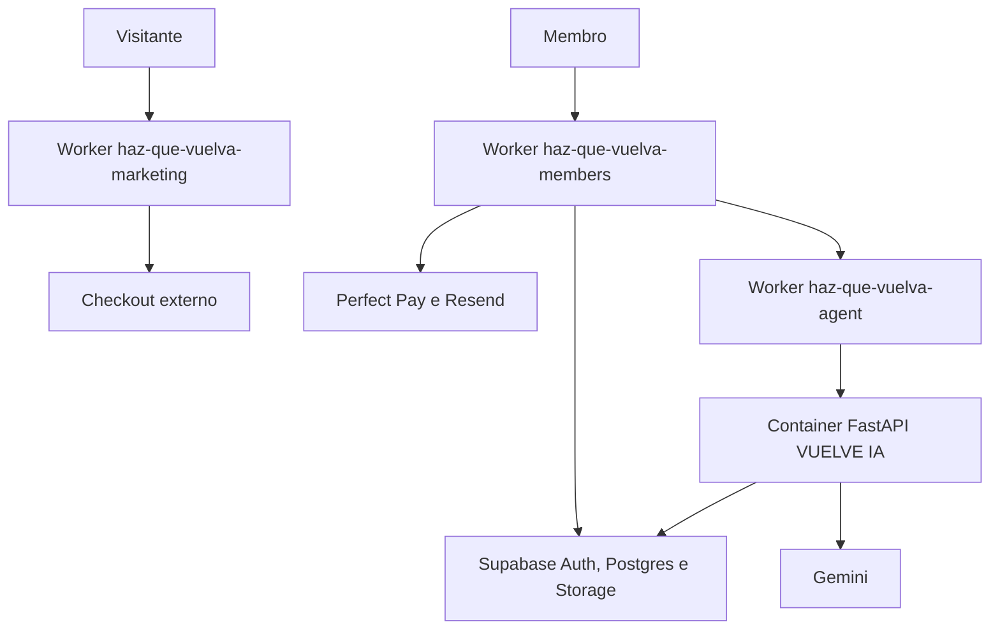

# Publicação no Cloudflare

## Estado

A topologia e os artefatos locais estão preparados. Nenhum Worker, contêiner,
domínio, variável ou segredo foi criado na conta Cloudflare por esta operação.
Publicação, tráfego real e ativação das integrações continuam pendentes de uma
autorização separada.

## Topologia escolhida



- `apps/marketing` e `apps/web` usam Next.js no Workers Runtime por meio do
  OpenNext.
- `apps/agent` mantém a aplicação FastAPI existente em um Cloudflare Container.
  Um Worker pequeno valida rota e credencial antes de encaminhar a requisição.
- A VUELVE IA continua desligada por padrão.
- Supabase permanece como autoridade de identidade, dados, RLS, arquivos e
  memória vetorial.
- Não há motivo técnico para colocar os dois apps Next.js em Cloudflare Pages;
  a integração atual recomendada para Next.js full-stack é Workers + OpenNext.

## Aplicações e domínios

| Aplicação | Worker | Domínio pretendido | Exposição |
|---|---|---|---|
| Marketing e quiz | `haz-que-vuelva-marketing` | `hazquevuelva.site` | pública |
| Área de membros e BFF | `haz-que-vuelva-members` | `miembros.hazquevuelva.site` | pública, com autorização no app e RLS |
| VUELVE IA | `haz-que-vuelva-agent` | sem domínio público | somente chamada autenticada pelo BFF |

Na primeira homologação, os três serviços devem usar Preview URLs. O domínio
principal só entra depois do smoke test remoto. Para o agente, `workers.dev` e
Preview URLs devem ser desativados depois que a comunicação privada por Service
Binding substituir o URL público autenticado.

## Artefatos versionados

### Marketing e área de membros

Cada app possui:

- `wrangler.jsonc`;
- `open-next.config.ts`;
- scripts de build, preview, upload e deploy;
- cache imutável para `/_next/static/*`;
- binding de Assets;
- binding de Cloudflare Images;
- observabilidade habilitada;
- `.dev.vars.example` sem credenciais.

`apps/web/src/middleware.ts` permanece intencionalmente no Edge Runtime. O
Next.js 16 prefere `proxy.ts`, mas o adaptador Cloudflare ainda não suporta
Node.js Middleware. Essa camada faz apenas refresh/redirect otimista; a
autorização real continua no DAL e no RLS.

### Agente

O agente possui:

- Dockerfile Python 3.12 não-root;
- Worker TypeScript de borda;
- Durable Object que administra o ciclo de vida do Container;
- health check em `/health`;
- allowlist de rota para `POST /v1/generations/stream`;
- comparação de credencial em tempo constante no Worker e novamente no
  FastAPI;
- `FEATURE_GENERATION=false` por padrão;
- limite de três instâncias `lite`.

O contêiner precisa ser construído para `linux/amd64`. Cloudflare Containers
exige plano compatível e deve ter custo e limites confirmados antes de
produção.

## Versões fixadas

| Dependência | Versão |
|---|---|
| Node.js | `>=22.0.0` |
| Next.js | `16.2.12` |
| `@opennextjs/cloudflare` | `1.20.2` |
| Wrangler | `4.115.0` |
| `@cloudflare/containers` | `0.3.7` |
| Python do agente | `3.12` |

A `compatibility_date` está fixada em `2026-07-29`, a data mais recente aceita
pelo `workerd` empacotado no Wrangler validado localmente.

## Configuração do Workers Builds

Conectar o mesmo repositório três vezes, uma para cada Worker.

### Marketing

- Root directory: `apps/marketing`
- Build command: `npm ci && npm run build:cloudflare`
- Deploy command: `npx wrangler deploy`
- Include paths: `apps/marketing/*`

### Área de membros

- Root directory: `apps/web`
- Build command: `npm ci && npm run build:cloudflare`
- Deploy command: `npx wrangler deploy`
- Include paths: `apps/web/*`, `supabase/*`

### Agente

- Root directory: `apps/agent`
- Build command: `npm ci && npm run typecheck`
- Deploy command: `npx wrangler deploy`
- Include paths: `apps/agent/*`

O build deve usar Node 22. Mudanças que alterem contratos compartilhados ainda
devem disparar manualmente todos os consumidores até existir um workspace
compartilhado explícito.

## Variáveis e segredos

Não colocar valores reais em `wrangler.jsonc`, GitHub, arquivos `.env`,
comentários ou documentação.

### Marketing

| Nome | Tipo |
|---|---|
| `NEXT_PUBLIC_CHECKOUT_URL` | build variable e runtime variable |
| `NEXT_PUBLIC_QUIZ_SOCIAL_PROOF_PREVIEW` | manter `0` |

### Área de membros

Variáveis:

- `FEATURE_AUTH`
- `FEATURE_CONTENT`
- `FEATURE_PAYMENTS`
- `FEATURE_ADMIN`
- `FEATURE_VUELVE_IA`
- `NEXT_PUBLIC_SUPABASE_URL`
- `NEXT_PUBLIC_SUPABASE_PUBLISHABLE_KEY`
- `MEMBER_APP_URL`
- `MARKETING_APP_URL`
- `AGENT_INTERNAL_URL`
- `RESEND_FROM`

Segredos:

- `SUPABASE_SECRET_KEY`
- `PERFECT_PAY_WEBHOOK_TOKEN`
- `RESEND_API_KEY`
- `AGENT_INTERNAL_SECRET`
- `WORKER_INTERNAL_SECRET`

### VUELVE IA

Variáveis:

- `ENVIRONMENT`
- `FEATURE_GENERATION`
- `GEMINI_MODEL`
- `EMBEDDING_MODEL`
- `EMBEDDING_DIMENSIONS`
- `DAILY_RESPONSE_LIMIT`
- `SUPABASE_URL`

Segredos:

- `INTERNAL_SECRET`
- `GEMINI_API_KEY`
- `SUPABASE_SECRET_KEY`

`AGENT_INTERNAL_SECRET` no BFF e `INTERNAL_SECRET` no agente precisam conter o
mesmo valor aleatório de pelo menos 32 caracteres. A rotação deve aceitar uma
janela controlada ou ocorrer em uma publicação coordenada.

## Sequência segura de publicação

1. Confirmar plano, conta, zona DNS e limites de Workers/Containers.
2. Criar os três Workers sem domínio customizado.
3. Cadastrar build variables e secrets diretamente no Cloudflare.
4. Fazer upload de uma versão sem tráfego de produção.
5. Executar smoke tests nas Preview URLs.
6. Validar logs sem PII, métricas, cold start e respostas de erro.
7. Promover primeiro marketing, depois área de membros.
8. Manter todas as feature flags de backend desligadas.
9. Conectar `hazquevuelva.site` e `miembros.hazquevuelva.site`.
10. Publicar o agente somente após build real da imagem e teste de autenticação.
11. Trocar o acesso público do agente por Service Binding e desabilitar
    `workers.dev`.
12. Ativar cada integração em uma operação independente, com rollback
    comprovado.

## Comandos locais

Na raiz:

```bash
npm run check:cloudflare:marketing
npm run check:cloudflare:web
npm run check:cloudflare:agent
```

Preview fiel ao runtime:

```bash
cd apps/marketing
npm run preview

cd ../web
npm run preview
```

Criar uma versão para homologação, sem decidir tráfego de produção:

```bash
cd apps/marketing
npm run upload
```

Não executar `deploy` até que conta, secrets, domínio, smoke test e rollback
estejam aprovados.

## Smoke test remoto obrigatório

### Marketing

- `/` redireciona para `/quiz`;
- `/quiz` responde 200;
- imagens e áudio carregam;
- seletor de idioma e fluxo completo funcionam;
- CTA usa o checkout aprovado, em nova aba;
- nenhum marcador de preview interno aparece em produção.

### Área de membros

- `/`, `/login`, `/productos`, `/perfil` e `/administracion` respondem conforme
  papel e sessão;
- `/quiz` redireciona para `https://hazquevuelva.site/quiz`;
- cookies Secure/HttpOnly/SameSite estão corretos;
- middleware renova sessão, mas DAL/RLS negam acessos indevidos;
- download, admin, pagamentos e IA permanecem fechados enquanto as flags
  estiverem desligadas.

### Agente

- `GET /health` responde sem inicializar geração;
- rota desconhecida responde 404;
- geração sem credencial responde 401;
- segredo ausente responde 503;
- geração desligada responde 503 mesmo com credencial válida;
- a imagem roda como usuário não-root;
- logs não contêm prompt, conversa, chaves ou dados pessoais.

## Rollback

- Preservar a versão anterior de cada Worker.
- Promover versões gradualmente somente depois da primeira homologação.
- Se marketing falhar, voltar sua versão sem tocar a área de membros.
- Se a área de membros falhar, voltar sua versão e manter backend flags
  desligadas.
- Se o agente falhar, desligar `FEATURE_VUELVE_IA`; a biblioteca deve continuar
  disponível.
- Rollback de código não substitui rollback de migração. Migrações Supabase
  exigem plano próprio e restauração testada.

## Pendências reais

- autenticar o Wrangler na conta correta;
- confirmar plano pago e disponibilidade de Containers;
- cadastrar secrets e variáveis;
- construir e executar a imagem Docker localmente ou em CI;
- criar Preview URLs;
- testar cold start do contêiner;
- configurar Service Binding;
- conectar os dois domínios;
- validar observabilidade, alertas e rollback remoto;
- aprovar e executar a publicação.
