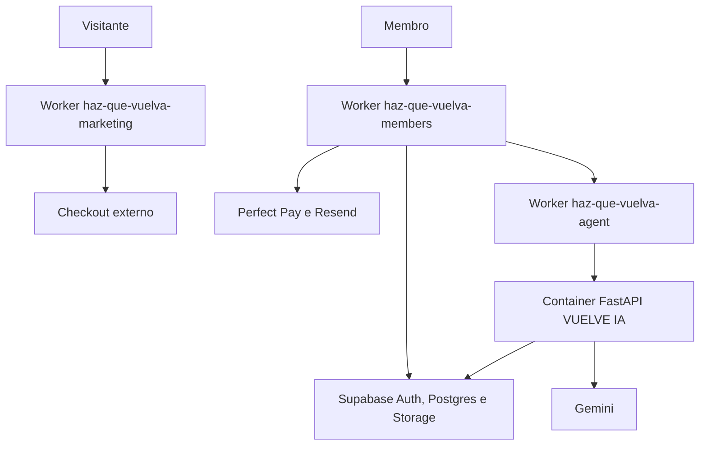

# Publicação no Cloudflare

## Estado

O site público e o quiz estão em produção no Worker
`haz-que-vuelva-marketing`, versão
`74092287-dd30-4e9d-99a2-058797845e8a`, publicado a partir do commit
`85047fe457fd63b1e0a21e8d3902850e2313ed3e`.

O domínio customizado `hazquevuelva.site`, seu DNS e seu certificado TLS foram
criados pelo Cloudflare. Requisições HTTP são redirecionadas permanentemente
para HTTPS no Worker. A área de membros, o Container do agente e as integrações
reais continuam fechados até seus próprios gates.

## Topologia escolhida



- `apps/marketing` e `apps/web` usam Next.js no Workers Runtime por meio do
  OpenNext.
- `apps/agent` mantém a aplicação FastAPI existente em um Cloudflare Container.
  Um Worker pequeno valida rota e credencial antes de encaminhar a requisição.
- A VUELVE IA continua desligada por padrão.
- Supabase permanece como autoridade de identidade, dados, RLS, arquivos e
  memória vetorial.
- Não há motivo técnico para colocar os dois apps Next.js em Cloudflare Pages;
  a integração atual recomendada para Next.js full-stack é Workers + OpenNext.

## Aplicações e domínios

| Aplicação | Worker | Domínio | Estado |
|---|---|---|---|
| Marketing e quiz | `haz-que-vuelva-marketing` | `hazquevuelva.site` | produção |
| Área de membros e BFF | `haz-que-vuelva-members` | `miembros.hazquevuelva.site` | não publicado |
| VUELVE IA | `haz-que-vuelva-agent` | sem domínio público | não publicado |

O Worker de marketing não expõe `workers.dev` nem Preview URL. Para os serviços
restantes, a primeira homologação deve usar uma versão sem tráfego real. O
agente só poderá ser chamado por Service Binding depois do build e do teste
real do Container.

O GitHub executa CI em todo push de `main` e pull request. O run
[`30555070298`](https://github.com/verticalpartnersai-sketch/haz-que-vuelva-lw-dr/actions/runs/30555070298)
validou os quatro jobs: marketing, área de membros, Worker do agente e agente
Python. A promoção do Worker continua deliberadamente separada do CI enquanto
Workers Builds não estiver conectado com suas permissões próprias.

O workflow `Production smoke` executa a cada 30 minutos e também sob demanda.
Ele valida o redirecionamento HTTPS, a página do quiz, headers defensivos,
idioma padrão, metadata, sitemap, manifesto e assets críticos. Falhas ficam
registradas no GitHub Actions; canais externos de alerta ainda precisam ser
configurados antes do lançamento comercial.

## Artefatos versionados

### Marketing e área de membros

Cada app possui:

- `wrangler.jsonc`;
- `open-next.config.ts`;
- scripts de build, preview, upload e deploy;
- cache imutável para `/_next/static/*`;
- binding de Assets;
- binding de Cloudflare Images;
- observabilidade habilitada;
- `.dev.vars.example` sem credenciais.

`apps/web/src/middleware.ts` permanece intencionalmente no Edge Runtime. O
Next.js 16 prefere `proxy.ts`, mas o adaptador Cloudflare ainda não suporta
Node.js Middleware. Essa camada faz apenas refresh/redirect otimista; a
autorização real continua no DAL e no RLS.

### Agente

O agente possui:

- Dockerfile Python 3.12 não-root;
- Worker TypeScript de borda;
- Durable Object que administra o ciclo de vida do Container;
- health check em `/health`;
- allowlist de rota para `POST /v1/generations/stream`;
- comparação de credencial em tempo constante no Worker e novamente no
  FastAPI;
- `FEATURE_GENERATION=false` por padrão;
- limite de três instâncias `lite`.

O contêiner precisa ser construído para `linux/amd64`. Cloudflare Containers
exige plano compatível e deve ter custo e limites confirmados antes de
produção.

## Versões fixadas

| Dependência | Versão |
|---|---|
| Node.js | `>=22.0.0` |
| Next.js | `16.2.12` |
| `@opennextjs/cloudflare` | `1.20.2` |
| Wrangler | `4.115.0` |
| `@cloudflare/containers` | `0.3.7` |
| Python do agente | `3.12` |

A `compatibility_date` está fixada em `2026-07-29`, a data mais recente aceita
pelo `workerd` empacotado no Wrangler validado localmente.

## Configuração do Workers Builds

Conectar o mesmo repositório três vezes, uma para cada Worker.

### Marketing

- Root directory: `apps/marketing`
- Build command: `npm ci && npm run build:cloudflare`
- Deploy command: `npx wrangler deploy`
- Include paths: `apps/marketing/*`

### Área de membros

- Root directory: `apps/web`
- Build command: `npm ci && npm run build:cloudflare`
- Deploy command: `npx wrangler deploy`
- Include paths: `apps/web/*`, `supabase/*`

### Agente

- Root directory: `apps/agent`
- Build command: `npm ci && npm run typecheck`
- Deploy command: `npx wrangler deploy`
- Include paths: `apps/agent/*`

O build deve usar Node 22. Mudanças que alterem contratos compartilhados ainda
devem disparar manualmente todos os consumidores até existir um workspace
compartilhado explícito.

## Variáveis e segredos

Não colocar valores reais em `wrangler.jsonc`, GitHub, arquivos `.env`,
comentários ou documentação.

### Marketing

| Nome | Tipo |
|---|---|
| `NEXT_PUBLIC_CHECKOUT_URL` | build variable e runtime variable |

### Área de membros

Variáveis:

- `FEATURE_AUTH`
- `FEATURE_CONTENT`
- `FEATURE_PAYMENTS`
- `FEATURE_ADMIN`
- `FEATURE_VUELVE_IA`
- `NEXT_PUBLIC_SUPABASE_URL`
- `NEXT_PUBLIC_SUPABASE_PUBLISHABLE_KEY`
- `MEMBER_APP_URL`
- `MARKETING_APP_URL`
- `AGENT_INTERNAL_URL`
- `RESEND_FROM`

Segredos:

- `SUPABASE_SECRET_KEY`
- `PERFECT_PAY_WEBHOOK_TOKEN`
- `RESEND_API_KEY`
- `AGENT_INTERNAL_SECRET`
- `WORKER_INTERNAL_SECRET`

### VUELVE IA

Variáveis:

- `ENVIRONMENT`
- `FEATURE_GENERATION`
- `GEMINI_MODEL`
- `EMBEDDING_MODEL`
- `EMBEDDING_DIMENSIONS`
- `DAILY_RESPONSE_LIMIT`
- `SUPABASE_URL`

Segredos:

- `INTERNAL_SECRET`
- `GEMINI_API_KEY`
- `SUPABASE_SECRET_KEY`

`AGENT_INTERNAL_SECRET` no BFF e `INTERNAL_SECRET` no agente precisam conter o
mesmo valor aleatório de pelo menos 32 caracteres. A rotação deve aceitar uma
janela controlada ou ocorrer em uma publicação coordenada.

## Sequência segura dos serviços restantes

1. Cadastrar as variáveis e os segredos aprovados diretamente no Cloudflare.
2. Fazer upload da área de membros sem tráfego de produção.
3. Executar smoke tests remotos de autenticação e autorização.
4. Promover a área de membros com todas as feature flags de backend desligadas.
5. Conectar `miembros.hazquevuelva.site`.
6. Publicar o agente somente após build real da imagem e teste de autenticação.
7. Conectar BFF e agente por Service Binding, sem URL pública.
8. Ativar cada integração em uma operação independente, com rollback
   comprovado.

## Comandos locais

Na raiz:

```bash
npm run check:cloudflare:marketing
npm run check:cloudflare:web
npm run check:cloudflare:agent
```

Preview fiel ao runtime:

```bash
cd apps/marketing
npm run preview

cd ../web
npm run preview
```

Criar uma versão para homologação, sem decidir tráfego de produção:

```bash
cd apps/marketing
npm run upload
```

O deploy de marketing está autorizado e ativo. Não executar `deploy` da área de
membros ou do agente até que variáveis, segredos, smoke test e rollback do
respectivo serviço estejam aprovados.

## Smoke test remoto obrigatório

### Marketing

- [x] `/` redireciona para `/quiz`;
- [x] `/quiz` responde 200;
- [x] imagens e áudio carregam;
- [x] seletor de idioma e fluxo completo funcionam;
- [x] página final aprovada usa CTAs verdes e não exibe badge interno;
- [ ] CTA usa o checkout aprovado, em nova aba;
- [x] nenhum marcador de preview interno aparece em produção.
- [x] canonical, Open Graph, Twitter Card, robots, sitemap e manifesto
  respondem em produção;
- [x] respostas HTML entregam HSTS, `nosniff`, negação de frame, referrer
  policy e permissions policy;
- [x] requisições HTTP redirecionam para o mesmo caminho em HTTPS com status
  permanente 308;
- [x] áudio preserva duração e volume, permanece mudo antes do CTA inicial,
  começa automaticamente no gesto que inicia o quiz, mantém loop e foi
  reduzido de 5,09 MB para 2,04 MB.
- [x] smoke sintético versionado cobre a superfície pública e roda a cada
  30 minutos no GitHub Actions.

### Área de membros

- `/`, `/login`, `/productos`, `/perfil` e `/administracion` respondem conforme
  papel e sessão;
- `/quiz` redireciona para `https://hazquevuelva.site/quiz`;
- cookies Secure/HttpOnly/SameSite estão corretos;
- middleware renova sessão, mas DAL/RLS negam acessos indevidos;
- download, admin, pagamentos e IA permanecem fechados enquanto as flags
  estiverem desligadas.
- o Custom Worker executa as outboxes a cada minuto e ignora integrações cuja
  flag ou credencial esteja ausente;
- primeiro download retorna `202` e enfileira a cópia; após o Cron, a mesma
  ação recebe URL assinada somente do PDF individual em `member-sensitive`;
- PDF inválido, criptografado, acima de 12 MiB ou 300 páginas falha fechado e
  não entrega o original.

### Agente

- `GET /health` responde sem inicializar geração;
- rota desconhecida responde 404;
- geração sem credencial responde 401;
- segredo ausente responde 503;
- geração desligada responde 503 mesmo com credencial válida;
- a imagem roda como usuário não-root;
- logs não contêm prompt, conversa, chaves ou dados pessoais.

## Rollback

- Preservar a versão anterior de cada Worker.
- Promover versões gradualmente somente depois da primeira homologação.
- Se marketing falhar, voltar sua versão sem tocar a área de membros.
- Se a área de membros falhar, voltar sua versão e manter backend flags
  desligadas.
- Se o agente falhar, desligar `FEATURE_VUELVE_IA`; a biblioteca deve continuar
  disponível.
- Rollback de código não substitui rollback de migração. Migrações Supabase
  exigem plano próprio e restauração testada.

## Pendências reais

- receber e configurar `NEXT_PUBLIC_CHECKOUT_URL`;
- conectar Workers Builds ao repositório GitHub;
- confirmar plano pago e disponibilidade de Containers;
- cadastrar secrets e variáveis da área de membros e do agente;
- aplicar e validar `202607300013_content_watermark_delivery.sql` em projeto de
  homologação;
- confirmar plano de Workers com CPU suficiente para `pdf-lib` e medir um PDF
  real antes de ligar `FEATURE_CONTENT`;
- construir e executar a imagem Docker localmente ou em CI;
- testar cold start do contêiner;
- configurar Service Binding;
- publicar a área de membros e conectar `miembros.hazquevuelva.site`;
- validar observabilidade, alertas e rollback remoto;
- ativar integrações reais somente após os gates correspondentes.
