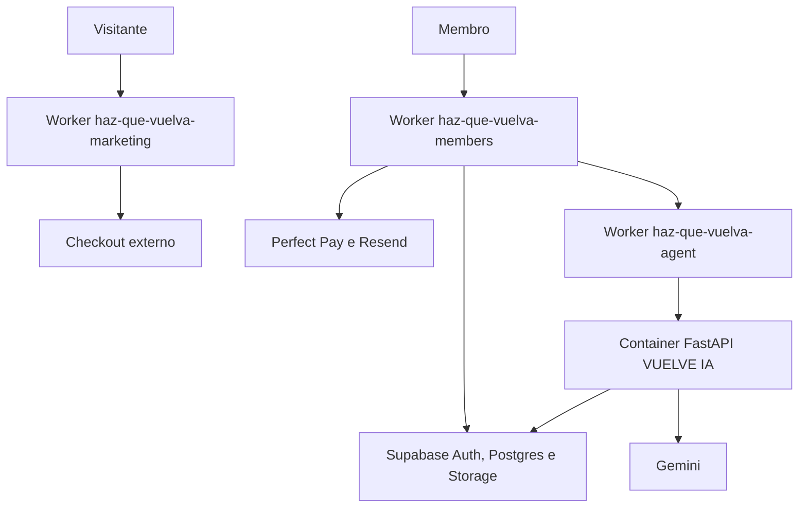

# Publicação no Cloudflare

## Estado

O site público e o quiz estão em produção no Worker
`haz-que-vuelva-marketing`.

O domínio customizado `hazquevuelva.site`, seu DNS e seu certificado TLS foram
criados pelo Cloudflare. Requisições HTTP são redirecionadas permanentemente
para HTTPS no Worker.

Em 30/07/2026, a área de membros foi publicada no domínio
`miembros.hazquevuelva.site` e o Container da VUELVE IA foi criado. O Supabase
Auth usa esse domínio como Site URL, permite somente callbacks explícitos,
mantém cadastro público fechado e restringe a administração ao proprietário
canônico, sem MFA obrigatório.

## Topologia escolhida



- `apps/marketing` e `apps/web` usam Next.js no Workers Runtime por meio do
  OpenNext.
- `apps/agent` mantém a aplicação FastAPI existente em um Cloudflare Container.
  Um Worker pequeno valida rota e credencial antes de encaminhar a requisição.
- A infraestrutura privada da VUELVE IA está publicada, mas a geração permanece
  desligada por flag até o smoke real e o gate jurídico. BFF e Worker exigem o
  mesmo segredo interno; o banco aplica entitlement e cota.
- Supabase permanece como autoridade de identidade, dados, RLS, arquivos e
  memória vetorial.
- Não há motivo técnico para colocar os dois apps Next.js em Cloudflare Pages;
  a integração atual recomendada para Next.js full-stack é Workers + OpenNext.

## Aplicações e domínios

| Aplicação | Worker | Domínio | Estado |
|---|---|---|---|
| Marketing e quiz | `haz-que-vuelva-marketing` | `hazquevuelva.site` | produção |
| Área de membros e BFF | `haz-que-vuelva-members` | `miembros.hazquevuelva.site` | produção; login obrigatório |
| VUELVE IA | `haz-que-vuelva-agent` | sem rota pública | Container acessível somente pelo Service Binding |

Marketing e agente não expõem `workers.dev` nem Preview URL. O BFF chama o
agente por Service Binding; BFF, Worker do agente e FastAPI continuam exigindo
entitlement, cota e a credencial interna. O binding privado reduz superfície de
rede, mas não substitui autenticação entre serviços.

O GitHub executa CI em todo push de `main` e pull request. O run
[`30555070298`](https://github.com/verticalpartnersai-sketch/haz-que-vuelva-lw-dr/actions/runs/30555070298)
validou os quatro jobs: marketing, área de membros, Worker do agente e agente
Python. A promoção do Worker continua deliberadamente separada do CI enquanto
Workers Builds não estiver conectado com suas permissões próprias.

Os deploys continuam manuais. A área de membros declara o ambiente
`production` e usa `wrangler deploy --env production`; marketing e agente não
possuem esse ambiente e devem usar `wrangler deploy` sem `--env production`.

O workflow `Production smoke` executa a cada 30 minutos e também sob demanda.
Ele valida o redirecionamento HTTPS, quiz, upsells, checkouts, headers
defensivos, metadata, assets críticos, login obrigatório e health da área de
membros. O teste de credencial Perfect Pay usa o probe
`x-hqv-auth-probe: 1`: mesmo se a autenticação regredir, a requisição não
projeta compra, acesso ou e-mail. Falhas ficam registradas no GitHub Actions;
o workflow abre ou atualiza um incidente persistente nas Issues e o encerra
automaticamente após a recuperação. O ciclo foi exercitado em 31 de julho de
2026: [criação](https://github.com/verticalpartnersai-sketch/haz-que-vuelva-lw-dr/actions/runs/30666452244),
[atualização sem duplicata](https://github.com/verticalpartnersai-sketch/haz-que-vuelva-lw-dr/actions/runs/30666526841)
e [recuperação](https://github.com/verticalpartnersai-sketch/haz-que-vuelva-lw-dr/actions/runs/30666587531)
foram registradas na [Issue 1](https://github.com/verticalpartnersai-sketch/haz-que-vuelva-lw-dr/issues/1).
Um canal de paging fora do GitHub ainda deve ser definido antes de escalar
tráfego.

O Browser Insights automático da zona tenta carregar o beacon do Cloudflare na
área de membros, mas a CSP deliberadamente restrita o bloqueia. Isso não quebra
o login. Antes de alterar a CSP, decidir se a telemetria é necessária e quais
dados poderão sair; caso contrário, desativar o Browser Insights para esse
host.

O executor canônico para a decisão aprovada é:

```bash
CLOUDFLARE_API_TOKEN='definido somente no shell local' \
CLOUDFLARE_ZONE_ID='<zone-id>' \
npm run cloudflare:rum
```

O comando é somente leitura por padrão. Ele valida o nome exato da zona e
mostra se criará, anexará ou reparará exclusivamente a regra com ref estável
`hqv_disable_members_rum`. Para executar, usar um token temporário limitado à
zona com leitura da zona e escrita de Select Configuration, definir a
confirmação exata exibida pelo plano e acrescentar `-- --execute`. Nunca colar
o token em chat, documentação, `.env` versionado ou histórico do shell.

O input manual `exercise_incident` força uma falha somente depois que o smoke
real termina com sucesso. Ele existe para provar criação, atualização e
encerramento do incidente sem falsificar indisponibilidade da aplicação.

## Artefatos versionados

### Marketing e área de membros

Cada app possui:

- `wrangler.jsonc`;
- `open-next.config.ts`;
- scripts de build, preview, upload e deploy;
- cache imutável para `/_next/static/*`;
- binding de Assets;
- binding de Cloudflare Images;
- observabilidade habilitada;
- `.dev.vars.example` sem credenciais.

`apps/web/src/middleware.ts` permanece intencionalmente no Edge Runtime. O
Next.js 16 prefere `proxy.ts`, mas o adaptador Cloudflare ainda não suporta
Node.js Middleware. Essa camada faz apenas refresh/redirect otimista; a
autorização real continua no DAL e no RLS.

### Agente

O agente possui:

- Dockerfile Python 3.12 não-root;
- Worker TypeScript de borda;
- Durable Object que administra o ciclo de vida do Container;
- health check interno em `/health`;
- allowlist de rota para `POST /v1/generations/stream`;
- comparação de credencial em tempo constante no Worker e novamente no
  FastAPI;
- `FEATURE_GENERATION=false` por padrão na publicação;
- limite de três instâncias `lite`.

O contêiner precisa ser construído para `linux/amd64`. Cloudflare Containers
exige plano compatível e deve ter custo e limites confirmados antes de
produção.

## Versões fixadas

| Dependência | Versão |
|---|---|
| Node.js | `>=22.0.0` |
| Next.js | `16.2.12` |
| `@opennextjs/cloudflare` | `1.20.2` |
| Wrangler | `4.115.0` |
| `@cloudflare/containers` | `0.3.7` |
| Python do agente | `3.12` |

A `compatibility_date` está fixada em `2026-07-29`, a data mais recente aceita
pelo `workerd` empacotado no Wrangler validado localmente.

## Configuração do Workers Builds

Conectar o mesmo repositório três vezes, uma para cada Worker.

### Marketing

- Root directory: `apps/marketing`
- Build command: `npm ci && npm run build:cloudflare`
- Deploy command: `npx wrangler deploy`
- Include paths: `apps/marketing/*`

### Área de membros

- Root directory: `apps/web`
- Build command: `npm ci && npm run build:cloudflare`
- Deploy command: `npx wrangler deploy --env production`
- Include paths: `apps/web/*`, `supabase/*`

### Agente

- Root directory: `apps/agent`
- Build command: `npm ci && npm run typecheck`
- Deploy command: `npx wrangler deploy`
- Include paths: `apps/agent/*`

O build deve usar Node 22. Mudanças que alterem contratos compartilhados ainda
devem disparar manualmente todos os consumidores até existir um workspace
compartilhado explícito.

## Variáveis e segredos

Não colocar valores reais em `wrangler.jsonc`, GitHub, arquivos `.env`,
comentários ou documentação.

### Marketing

O checkout do produto principal está versionado no módulo de configuração do
quiz. Os checkouts de Reconquista 30 e Diagnóstico VUELVE IA são injetados no
build por `NEXT_PUBLIC_UPSELL_1_ACCEPT_URL` e
`NEXT_PUBLIC_UPSELL_2_ACCEPT_URL`. Os checkouts dos downsells serão injetados
por `NEXT_PUBLIC_DOWNSELL_1_ACCEPT_URL` e
`NEXT_PUBLIC_DOWNSELL_2_ACCEPT_URL` depois da aprovação comercial; até lá, os
aceites de `/d1` e `/d2` permanecem sem cobrança. O smoke deve confirmar que
as URLs publicadas e seus redirecionadores preservam parâmetros de atribuição.

### Área de membros

Variáveis:

- `MEMBER_APP_MODE`
- `FEATURE_AUTH`
- `FEATURE_CONTENT`
- `FEATURE_PAYMENTS`
- `FEATURE_ADMIN`
- `FEATURE_VUELVE_IA`
- `NEXT_PUBLIC_SUPABASE_URL`
- `NEXT_PUBLIC_SUPABASE_PUBLISHABLE_KEY`
- `MEMBER_APP_URL`
- `MARKETING_APP_URL`
- `AGENT_SERVICE_BINDING`
- `RESEND_FROM`
- `AI_DAILY_TOKEN_BUDGET` — positiva e obrigatória antes de ativar a IA;
  define o teto de tokens totais em uma janela móvel de 24 horas.

Segredos:

- `NEXT_PUBLIC_SUPABASE_URL`
- `NEXT_PUBLIC_SUPABASE_PUBLISHABLE_KEY`
- `SUPABASE_SECRET_KEY`
- `PERFECT_PAY_WEBHOOK_TOKEN`
- `RESEND_API_KEY`
- `AGENT_INTERNAL_SECRET`
- `WORKER_INTERNAL_SECRET`

### VUELVE IA

Variáveis:

- `ENVIRONMENT`
- `FEATURE_GENERATION`
- `GEMINI_MODEL`
- `EMBEDDING_MODEL`
- `EMBEDDING_DIMENSIONS`
- `DAILY_RESPONSE_LIMIT`
- `MAX_OUTPUT_TOKENS`
- `SUPABASE_URL`

Segredos:

- `INTERNAL_SECRET`
- `GEMINI_API_KEY`
- `SUPABASE_SECRET_KEY`

`AGENT_INTERNAL_SECRET` no BFF e `INTERNAL_SECRET` no agente precisam conter o
mesmo valor aleatório de pelo menos 32 caracteres. A rotação deve aceitar uma
janela controlada ou ocorrer em uma publicação coordenada.

## Sequência segura de publicação

1. Publicar primeiro a área de membros com o Service Binding declarado; a
   versão anterior do agente continua atendendo durante a transição.
2. Publicar o agente com `preview_urls=false`. O `workers_dev` permanece ativo
   exclusivamente como ponte autenticada para o Workers AI e para o backfill de
   embeddings; todas as rotas exigem `INTERNAL_SECRET` ou
   `PROVIDER_BACKFILL_SECRET` antes de processar qualquer payload. O tráfego da
   área de membros continua usando o Service Binding privado.
3. Publicar marketing e confirmar as saídas `/up1` → `/d1`, `/d1` →
   `/gracias`, `/up2` → `/d2` e `/d2` → `/gracias`.
4. Executar o smoke remoto de toda a superfície pública.
5. Preservar os IDs das versões anteriores para rollback independente.

## Comandos locais

Na raiz:

```bash
npm run check:cloudflare:marketing
npm run check:cloudflare:web
npm run check:cloudflare:agent
```

Preview fiel ao runtime:

```bash
cd apps/marketing
npm run preview

cd ../web
npm run preview
```

Criar uma versão para homologação, sem decidir tráfego de produção:

```bash
cd apps/web
npm run upload
```

O ambiente `production` da área de membros declara o Custom Domain, o Service
Binding, os segredos obrigatórios e falha fechado com `503` quando a
configuração real estiver incompleta.

## Smoke test remoto obrigatório

### Marketing

- [x] `/` redireciona para `/quiz`;
- [x] `/quiz` responde 200;
- [x] imagens e áudio carregam;
- [x] seletor de idioma e fluxo completo funcionam;
- [x] página final aprovada usa CTAs verdes e não exibe badge interno;
- [x] CTA usa o checkout Centerpag aprovado, em nova aba, preservando UTMs e
  contexto da rota; o smoke sintético valida a URL no JavaScript publicado, a
  disponibilidade do redirecionador e a preservação dos parâmetros;
- [x] nenhum marcador de preview interno aparece em produção.
- [x] canonical, Open Graph, Twitter Card, robots, sitemap e manifesto
  respondem em produção;
- [x] respostas HTML entregam HSTS, `nosniff`, negação de frame, referrer
  policy e permissions policy;
- [x] requisições HTTP redirecionam para o mesmo caminho em HTTPS com status
  permanente 308;
- [x] áudio preserva duração, loop, controle manual e foi reduzido de 5,09 MB
  para 2,04 MB;
- [x] o CTA inicia a reprodução ainda muda (`muted=true`, `paused=false`) e a
  usuária pode ativar o som pelo controle do cabeçalho;
- [x] smoke sintético versionado cobre a superfície pública e roda a cada
  30 minutos no GitHub Actions.
- [x] `/up1` e `/up2` carregam os checkouts correspondentes e preservam
  parâmetros de atribuição;
- [x] Publicar a revisão em que `/d1` preserva parâmetros até `/gracias`,
  `/up2` recusa para `/d2` e `/d2` preserva parâmetros até `/gracias`; os
  aceites dos downsells devem continuar sem cobrança enquanto seus checkouts
  não estiverem configurados.

### Área de membros

- [x] `/` redireciona a sessão anônima para `/login?next=%2F`;
- [x] `/productos`, `/perfil`, `/administracion` e `/ia` também redirecionam
  sessões anônimas para o login preservando o destino;
- [x] `/login` e `/healthz` respondem 200;
- [x] `/quiz` redireciona para `https://hazquevuelva.site/quiz`;
- `/productos`, `/perfil` e `/administracion` respondem conforme
  papel e sessão;
- cookies Secure/HttpOnly/SameSite estão corretos;
- middleware renova sessão, mas DAL/RLS negam acessos indevidos;
- o Custom Worker executa as outboxes a cada minuto e ignora integrações cuja
  flag ou credencial esteja ausente;
- depois dos processadores, o mesmo Cron consulta a saúde operacional por rota
  interna autenticada. Job morto, lock acima de 5 minutos, job disponível ou
  evento Perfect Pay sem processamento acima de 10 minutos transforma a
  execução em erro observável, sem expor contagens na superfície pública;
- primeiro download retorna `202` e enfileira a cópia; após o Cron, a mesma
  ação recebe URL assinada somente do PDF individual em `member-sensitive`;
- PDF inválido, criptografado, acima de 12 MiB ou 300 páginas falha fechado e
  não entrega o original.

### Agente

- [x] o smoke comprova que o endpoint público antigo responde 404 e que a
  geração permanece indisponível por flag;
- o Service Binding é a única entrada de rede do agente;
- Worker e FastAPI rejeitam credencial interna ausente ou inválida;
- rota desconhecida responde 404 dentro do binding;
- geração desligada responde 503 mesmo com credencial válida;
- a imagem roda como usuário não-root;
- logs não contêm prompt, conversa, chaves ou dados pessoais.

### Evidência do rollout de 31 de julho de 2026

- área de membros: versão `637aef83-8f4a-4132-bde3-5cb4c1592302` em
  `miembros.hazquevuelva.site`;
- agente privado: versão de borda
  `910ee45f-ac17-435b-819c-ee51beb68242`, com `workers.dev` desativado e
  geração desligada por flag;
- marketing: versão `3a5ad1db-2f1d-4d2c-92ee-13265e9daa65` em
  `hazquevuelva.site`;
- `scripts/production-smoke.sh` passou contra os dois domínios públicos e o
  endpoint público antigo do agente passou a responder 404. O mesmo smoke
  comprova os redirects protegidos, token Perfect Pay inválido com 401 por um
  probe intrinsecamente não mutável, stream acima de 64 KiB com 413 e geração
  desligada com 503;
- a rota `/api/internal/operations/health` rejeitou a chamada sem credencial
  com 401, e o Cron `* * * * *` da versão publicada executou o ciclo completo
  com status `Ok` nos Workers Logs;
- o deploy do agente usou `--containers-rollout=none`, pois o daemon Docker
  local não estava disponível. A camada Worker foi atualizada, mas a imagem do
  Container permaneceu na versão já publicada. Antes de habilitar a geração,
  reconstruir e publicar a imagem deliberadamente e executar o smoke privado.

### Evidência do rollout de 4 de agosto de 2026

- marketing: versão `6fe59bbb-0515-4175-9022-08d3e8fa9e97`, servindo 100% do
  tráfego de `hazquevuelva.site`;
- `/d1?utm_source=codex-prod&order=synthetic-123` respondeu 200 e o clique de
  recusa chegou a `/up2` preservando os dois parâmetros;
- a recusa de `/up1` chegou a `/d1` com os mesmos parâmetros;
- `/downsell1` respondeu 404 e o asset novo `hero-message.webp` respondeu 200;
- Playwright confirmou ausência de overflow em 390 × 844 e 1440 × 900, sem
  erros ou avisos no console;
- `NEXT_PUBLIC_DOWNSELL_1_ACCEPT_URL` continua ausente; por isso o aceite da
  oferta permanece corretamente desabilitado e sem cobrança.

Essa evidência comprova roteamento e configuração pública do rollout. Ela não
substitui os testes reais de compra, e-mail, autorização por usuário nem geração
Gemini listados nas pendências.

### Evidência do rollout de UP2/D2 em 4 de agosto de 2026

- código: commit `e00d968796b2fa6042c8c946cc5f906813e76d11`, sincronizado
  entre `main` local e `origin/main`;
- CI do commit concluída com sucesso no GitHub;
- marketing: versão `675a8d86-d708-4d7b-9b8e-ead4fb383036`, publicada no
  domínio `hazquevuelva.site`;
- `/up2`, `/d2`, `/d1` e `/gracias` responderam 200 depois da propagação;
- Playwright comprovou em produção `D1 → /gracias`, `UP2 → /d2` e
  `D2 → /gracias`, preservando `utm_source`, `order` e os demais parâmetros;
- as heroes de UP2, D2 e D1 não contêm preço; o checkout configurado de UP2
  preserva a atribuição e o aceite de D2 permanece desabilitado porque
  `NEXT_PUBLIC_DOWNSELL_2_ACCEPT_URL` ainda não foi configurada;
- não houve overflow em 390 × 844 ou 1440 × 900, nem erro ou aviso no console.

O primeiro probe de `/d2` ocorreu durante a propagação e respondeu 404; uma
nova requisição sem cache e o percurso completo no navegador responderam 200.
Esta evidência comprova publicação e roteamento, não compra one-click,
entitlement ou acesso ao produto.

### Evidência do redesign de UP2/D2 em 4 de agosto de 2026

- código: commit `f8c6adbeba42f7a47611be1cce276c0e97b25f14`, enviado para
  `origin/main`;
- marketing: versão `30b847af-8651-4051-9705-c51b9f2650b5`, publicada no
  domínio `hazquevuelva.site`;
- UP2 e D2 passaram a herdar o sistema visual `r30-*` da página final, de UP1
  e de D1, com botões equivalentes, depoimentos manuais e rodapé compartilhado;
- o mockup inventado foi substituído por capturas reais da VUELVE IA em
  desktop e mobile, usando apenas uma conversa sintética em ambiente local;
- `/up2`, `/d2`, `/gracias` e os novos assets responderam 200 depois da
  propagação do Worker;
- Playwright comprovou no domínio público `UP2 → /d2 → /gracias`, preservando
  `utm_source`, `order` e os demais parâmetros da query;
- as heroes de UP2 e D2 não contêm preço; as duas páginas exibem depoimentos e
  não possuem botão de pausa;
- não houve overflow em 390 × 844 ou 1440 × 900, nem erro ou aviso no console.

A primeira leitura de UP2 e alguns assets ocorreu durante a propagação e ainda
serviu a versão anterior. Uma nova requisição sem cache e o percurso completo
no navegador serviram a versão `30b847af-8651-4051-9705-c51b9f2650b5`. Esta
evidência visual e de roteamento não substitui uma compra one-click controlada,
entitlement ou acesso autenticado ao produto.

## Rollback

- Preservar a versão anterior de cada Worker.
- Promover versões gradualmente somente depois da primeira homologação.
- Se marketing falhar, voltar sua versão sem tocar a área de membros.
- Se a área de membros falhar, voltar sua versão e manter backend flags
  desligadas.
- Se o agente falhar, desligar `FEATURE_VUELVE_IA`; a biblioteca deve continuar
  disponível.
- Rollback de código não substitui rollback de migração. Migrações Supabase
  exigem plano próprio e restauração testada.

O executor canônico para reduzir erro operacional é:

```bash
scripts/cloudflare-rollback.sh <marketing|members|agent> <version-id>
```

Sem `--execute`, ele apenas valida o alvo e lista deployments. A execução real
exige `--execute` e `HQV_ROLLBACK_CONFIRM` exatamente no formato
`<worker-name>:<version-id>`. Depois da promoção, o script executa o smoke de
produção e falha se marketing, membros, webhook defensivo ou agente privado
divergirem. O drill real continua obrigatório porque rollback de Worker não
reverte Supabase, Storage nem outros recursos vinculados.

## Pendências reais

- testar as mutações administrativas reais com o proprietário canônico e
  reautenticação por senha;
- aguardar a aprovação comercial dos produtos pela Perfect Pay;
- executar compra, revogação, convite Resend e geração Gemini com identidades
  de teste autorizadas;
- validar os cinco mapeamentos Perfect Pay com payloads reais redigidos;
- conectar Workers Builds ao repositório GitHub;
- configurar um canal externo para receber os erros operacionais já detectados
  pelo Cron e alertas de orçamento do Container/Gemini;
- testar restauração, observabilidade, alertas e rollback remoto.
