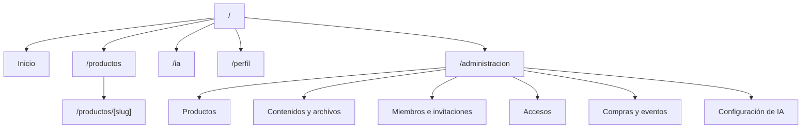
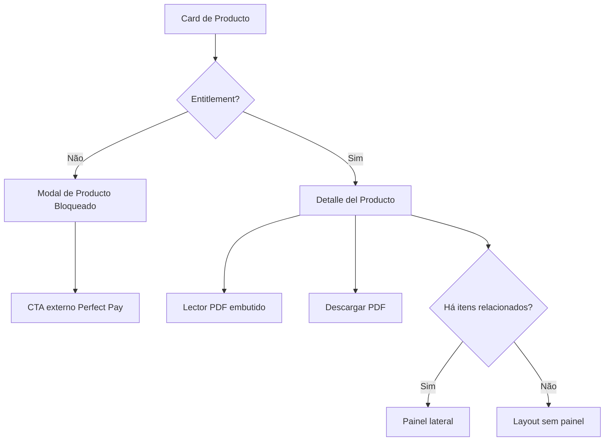
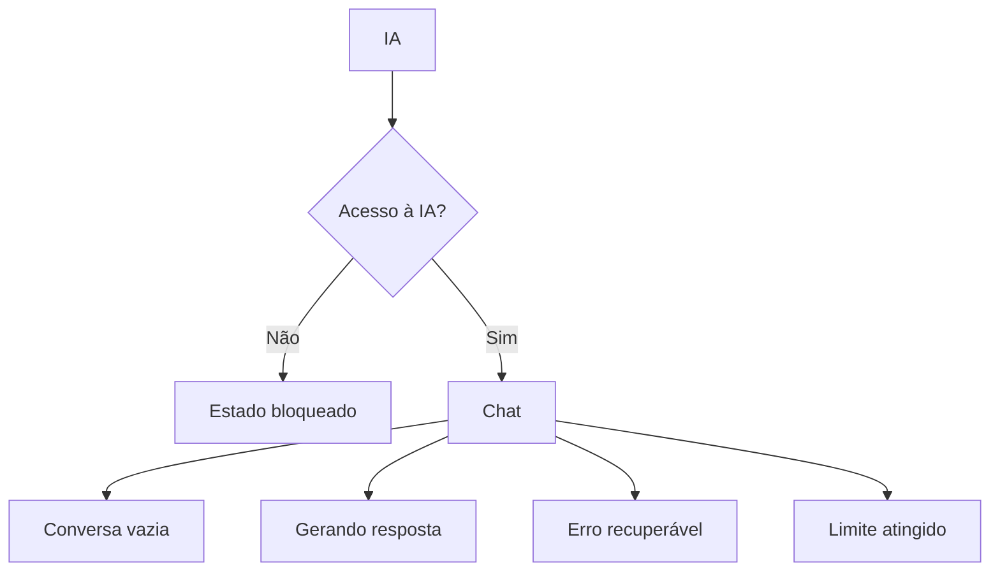

# Mapa de navegação

## Rotas propostas

Nenhuma rota abaixo está implementada ou aprovada como URL definitiva.

## Navegação principal

| Item | `member` | `admin` | Comportamento |
|---|---:|---:|---|
| `Inicio` | Sim | Sim | Home com hero e trilhos |
| `Productos` | Sim | Sim | Catálogo completo |
| `IA` | Sim | Sim | Chat ou estado bloqueado por entitlement |
| `Perfil` | Sim | Sim | Dados e preferências |
| `Administración` | Não | Sim | Shell administrativo |
| `Cerrar sesión` | Sim | Sim | Ação fixa no rodapé |

No desktop, usar sidebar vertical estreita. No mobile, adaptar para dock inferior
ou painel que preserve rótulos acessíveis.

## Fluxo de produto

## Fluxo da IA

No gate frontend, todos os estados usam mocks explícitos e nenhuma chamada
externa.

## Administração

O gate frontend terá apenas estrutura estática para validar arquitetura de
informação. Operações, formulários conectados, upload e dados reais ficam
proibidos até o backend ser aprovado.

## Regras de transição

- Produto bloqueado abre modal sem alterar a rota.
- Produto disponível navega para o detalhe.
- Fechar modal devolve foco ao card.
- Painel lateral não reserva espaço quando não houver itens.
- Comentários não aparecem quando a flag estiver desligada.
- Rota administrativa nunca aparece para `member`.
- Acesso direto a rota futura deverá ser autorizado no servidor, não só oculto
  na navegação.
