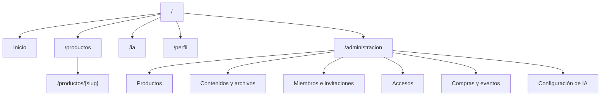
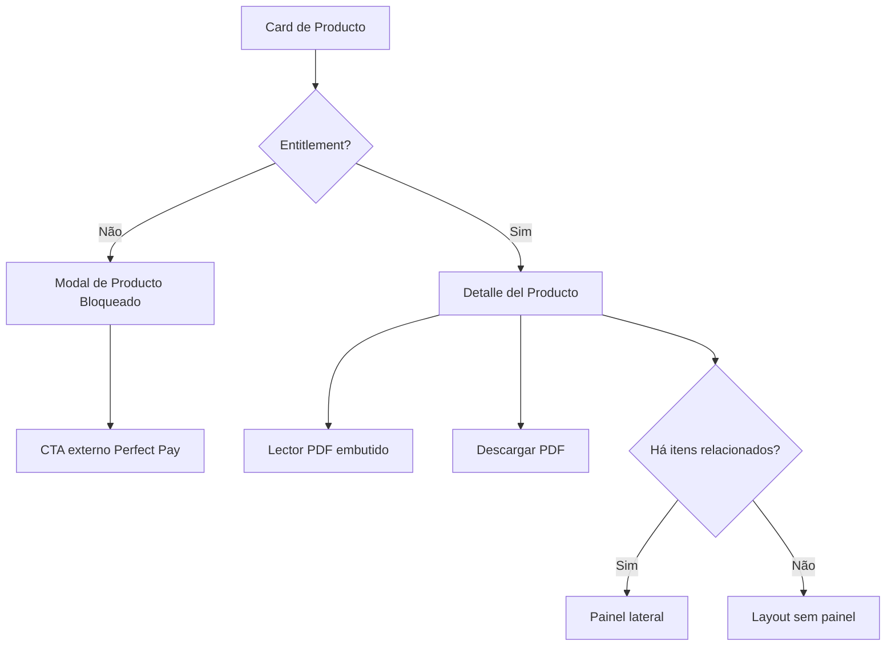
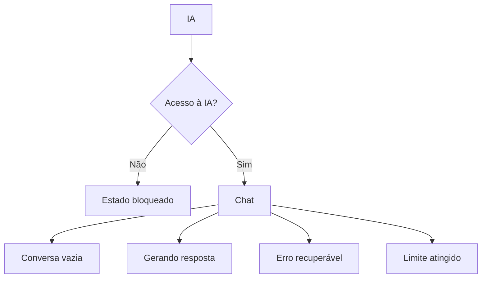

# Mapa de navegação

## Rotas propostas

Nenhuma rota abaixo está implementada ou aprovada como URL definitiva.

## Navegação principal

| Item | `member` | `admin` | Comportamento |
|---|---:|---:|---|
| `Inicio` | Sim | Sim | Home com hero e trilhos |
| `Productos` | Sim | Sim | Catálogo completo |
| `IA` | Sim | Sim | Chat ou estado bloqueado por entitlement |
| `Perfil` | Sim | Sim | Dados e preferências |
| `Administración` | Não | Sim | Shell administrativo |
| `Cerrar sesión` | Sim | Sim | Ação fixa no rodapé |

No desktop, usar sidebar vertical estreita. No mobile, adaptar para dock inferior
e painel de conta que preserve rótulos acessíveis.

## Arquitetura de informação

### Nível global

1. `Inicio`: descoberta editorial e visão de todos os produtos.
2. `Productos`: catálogo completo e estados de acesso.
3. `IA`: capacidade premium, disponível ou bloqueada.
4. `Perfil`: identidade e preferências.
5. `Administración`: operações futuras, somente admin.

`Inicio` e `Productos` não são duplicatas: Inicio organiza narrativa e
descoberta em hero/trilhos; Productos prioriza varredura do catálogo. Filtros
só entram após existir taxonomia real.

### Nível contextual

- Detalhe do produto pertence a `Productos`, mesmo quando aberto por `Inicio`.
- Modal bloqueado mantém o contexto da página de origem e não cria rota.
- Histórico da IA pertence a `IA`, não à navegação global.
- Seções administrativas usam navegação secundária dentro de
  `Administración`.

### Hierarquia de heading

- Uma página possui um `h1`.
- Trilhos e regiões principais usam `h2`.
- Card não introduz heading que quebre a estrutura; o nome continua texto
  programaticamente associado ao link ou botão.
- Modal possui título próprio referenciado pelo dialog.

## Navegação responsiva

| Destino | Desktop `SideRail` | Mobile `MobileDock` | Página `Perfil` mobile |
|---|---:|---:|---:|
| `Inicio` | Sim | Sim | Não |
| `Productos` | Sim | Sim | Não |
| `IA` | Sim | Sim | Não |
| `Perfil` | Sim | Sim | Página atual |
| `Administración` | Admin | Não | Admin |
| `Cerrar sesión` | Rodapé | Não | Sim |

- Desktop: rail com `shell.rail.width`, sticky, ícones, tooltips e item ativo.
- Mobile: dock com quatro destinos persistentes e rótulos visíveis.
- `Perfil` no dock navega diretamente para `/perfil`; não abre modal.
- Admin mobile: `Administración` entra na seção de conta da página `Perfil`
  para não comprimir seis ações em 320 px.
- `Cerrar sesión` permanece no rodapé do rail ou no fim da seção de conta em
  `Perfil`.
- Wordmark navega para `Inicio`; não substitui o link de pular para conteúdo.

## Anatomia das páginas

| Página | Cabeçalho/entrada | Corpo | Ação persistente |
|---|---|---|---|
| `Inicio` | Wordmark + hero | Trilhos de todos os produtos | Navegação global |
| `Productos` | Título + descrição curta | Catálogo e estados | Navegação global |
| Detalhe | Voltar a Productos + título | Conteúdo, PDF e painel opcional | Download no contexto |
| `IA` | Título/capacidade | Bloqueio ou conversa | Composer quando liberada |
| `Perfil` | Título | Identidade e preferências | Nenhuma ação falsa |
| `Administración` | Título + navegação secundária | Esqueletos por domínio | Nenhum submit real |

Em largura compacta, breadcrumb textual pode ser reduzido a um link
`Volver a Productos`, preservando contexto sem ocupar várias linhas.

## Fluxo de produto

## Fluxo da IA

No gate frontend, todos os estados usam mocks explícitos e nenhuma chamada
externa.

## Administração

O gate frontend terá apenas estrutura estática para validar arquitetura de
informação. Operações, formulários conectados, upload e dados reais ficam
proibidos até o backend ser aprovado.

Após a aprovação do backend, `Contenidos y archivos` passa a permitir
publicação validada somente quando `FEATURE_AUTH`, `FEATURE_ADMIN` e
`FEATURE_CONTENT` estão ligadas e a sessão possui papel `admin`. Os demais
módulos continuam sem mutações até seus gates específicos.

Navegação secundária prevista:

1. `Resumen`
2. `Productos`
3. `Contenidos y archivos`
4. `Miembros e invitaciones`
5. `Accesos`
6. `Compras y eventos`
7. `Configuración de IA`

No desktop, a navegação secundária pode ser lateral dentro do conteúdo. No
mobile, usa uma lista/painel explícito; não comprime todos os itens em tabs
horizontais.

## Regras de transição

- Produto bloqueado abre modal sem alterar a rota.
- Produto disponível navega para o detalhe.
- Fechar modal devolve foco ao card.
- Painel lateral não reserva espaço quando não houver itens.
- Comentários não aparecem quando a flag estiver desligada.
- Rota administrativa nunca aparece para `member`.
- Acesso direto a rota futura deverá ser autorizado no servidor, não só oculto
  na navegação.
- Item atual usa `aria-current="page"`.
- Após toda navegação client-side de página, foco move para o `h1` de destino
  com `tabindex="-1"`; abertura/fechamento de modal e mudança local preservam o
  foco conforme o contrato do componente.
- Dock, rail e cabeçalhos sticky não encobrem elemento focado.
- Botão voltar usa histórico somente quando houver origem segura; caso
  contrário, navega para `Productos`.
- Deep link futuro para produto bloqueado não renderiza conteúdo antes da
  autorização.
- Estado da IA nunca é inferido pela presença do item na navegação.

## Contratos relacionados

Comportamento detalhado de `SideRail`, `MobileDock`, `ProfileScaffold`, modal,
trilhos e foco está em
[Contratos de componentes](COMPONENT-CONTRACTS.md#navegação-e-shell).
