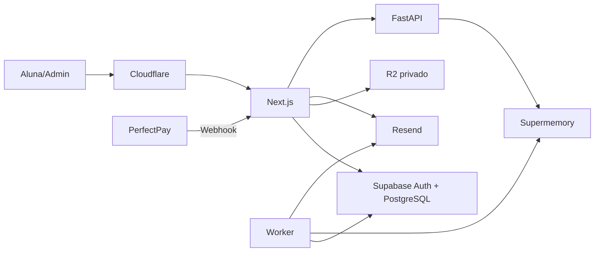

# HAZ QUE VUELVA — checklist mestre

> Documento vivo. Consulte-o antes de iniciar uma etapa e atualize os itens ao concluí-los.
>
> Estado: fundação Greenfield iniciada em 24 de julho de 2026.

## Produto

- Idioma: espanhol.
- Conteúdo inicial: e-books e anexos privados para download.
- Compra: Perfect Pay; front-end, order bump e upsells.
- Garantia: sete dias; reembolso, cancelamento e chargeback revogam acesso imediatamente.
- Papéis: `admin` e `member`.
- Infraestrutura: Hostinger VPS, Cloudflare, Supabase, Resend, Cloudflare R2 e Supermemory.
- A IA é um produto com permissão própria, implementada em Python.

## Princípios

1. Perfect Pay é a fonte de verdade para compras e reembolsos.
2. Toda autorização acontece no servidor e no banco; a UI nunca decide acesso.
3. Supabase é o histórico canônico de conversa. Supermemory é memória e RAG, não o único armazenamento.
4. Toda resposta substantiva da IA recupera conhecimento global aprovado e memória exclusiva da aluna.
5. Documentos de RAG são dados de referência, não instruções com autoridade.
6. Chaves são específicas por ambiente e nunca entram no Git.

## Arquitetura

## Domínios e tabelas

- `profiles`: perfil, papel e status da conta.
- `products` e `product_entitlements`: produtos e permissões concedidas.
- `content_items`, `content_files`, `content_access_rules`: e-books, anexos e autorização.
- `purchases`, `payment_webhook_events`, `entitlements`, `admin_overrides`: pagamentos e acessos.
- `agent_configs`, `agent_knowledge_documents`, `agent_conversations`, `agent_messages`, `agent_memory_sync_jobs`: IA, RAG e memória.
- `audit_logs`: alterações administrativas e eventos críticos.

## Memória e RAG

| Escopo | Conteúdo |
|---|---|
| `haz-que-vuelva:knowledge:global` | Método, FAQs e materiais aprovados |
| `haz-que-vuelva:user:{id}` | Memória exclusiva da aluna |
| Supabase | Transcrição integral, auditoria e reprocessamento |

- [ ] O agente verifica `agent_access` antes de responder.
- [ ] Cada pergunta recupera conhecimento global e memória individual filtrados.
- [ ] Cada mensagem é gravada no Supabase antes da sincronização assíncrona.
- [ ] O painel versiona prompt, permite rollback e registra quem publicou.
- [ ] Upload aceita somente tipos permitidos, tamanho limitado e armazenamento privado.
- [ ] Exclusão no Supermemory exige confirmação e mantém auditoria local.
- [ ] Nenhuma recuperação cruza dados de alunas.

## Checklist de implementação

### 0. Dados que ainda faltam

- [ ] Confirmar domínio definitivo.
- [ ] Criar produtos/planos na Perfect Pay e fornecer códigos, preços e nomes.
- [ ] Definir qual produto libera a IA.
- [ ] Entregar conteúdos, capas e documentos da base de conhecimento.
- [ ] Escolher modelo de IA, orçamento e limite de mensagens.
- [ ] Fornecer WhatsApp de suporte e referências visuais.

### 1. Contas e infraestrutura

- [ ] Criar projetos de produção e homologação no Supabase.
- [ ] Criar bucket R2 privado e política de CORS mínima.
- [ ] Criar projeto Supermemory dedicado.
- [ ] Criar Resend e verificar subdomínio com SPF, DKIM e DMARC.
- [ ] Criar VPS, DNS Cloudflare e segredos por ambiente.

### 2. Fundação do código

- [ ] Criar Next.js TypeScript com lint, typecheck e testes.
- [ ] Criar FastAPI para o agente.
- [ ] Criar Dockerfiles não-root e Docker Compose.
- [ ] Criar validação de variáveis de ambiente e `.env.example`.
- [ ] Criar migrações, RLS, healthcheck e logs estruturados.

### 3. Identidade

- [ ] Configurar Supabase Auth SSR.
- [ ] Criar perfil, papéis e RLS.
- [ ] Implementar convite, ativação e reset via Resend.
- [ ] Implementar perfil e solicitação aprovada de troca de e-mail.
- [ ] Exigir MFA para administradores antes da abertura pública.

### 4. Conteúdo e permissões

- [ ] Criar produtos, permissões e regras de acesso.
- [ ] Criar painel de conteúdo e arquivos.
- [ ] Fazer upload privado e validar arquivos.
- [ ] Gerar URL temporária somente após autorização.
- [ ] Implementar leitura, progresso e log de downloads.
- [ ] Gerar marca-d’água individual para downloads.

### 5. Perfect Pay

- [ ] Criar endpoint de webhook com validação e idempotência.
- [ ] Mapear códigos Perfect Pay para produtos internos.
- [ ] Liberar acesso em `approved`.
- [ ] Revogar acesso em `cancelled`, `refunded` e `charged_back`.
- [ ] Registrar e permitir reprocessamento seguro de eventos.
- [ ] Testar duplicidade, eventos fora de ordem e todos os estados escolhidos.

### 6. IA

- [ ] Implementar FastAPI, autorização e rate limit.
- [ ] Implementar adaptador Supermemory: busca, upload, listagem e exclusão.
- [ ] Implementar histórico canônico, outbox e retentativas.
- [ ] Implementar prompt versionado, base de conhecimento e painel.
- [ ] Testar isolamento entre duas alunas e exclusão de documento.
- [ ] Implementar limites de custo, telemetria e mensagens de falha seguras.

### 7. VPS e liberação

- [ ] Configurar servidor com SSH por chave, firewall, Docker e backups.
- [ ] Configurar proxy, Cloudflare, TLS e healthchecks.
- [ ] Configurar logs, alertas e deploy reproduzível com rollback.
- [ ] Testar autorização por objeto, compra, reembolso, download e IA.
- [ ] Testar celular, desktop, espanhol e fluxo de administrador.
- [ ] Criar administrador inicial com MFA e executar lançamento controlado.

## Critérios de aceite

- Compra aprovada libera somente o produto comprado.
- Reembolso, cancelamento ou chargeback revogam o acesso correto.
- Uma aluna não acessa conteúdo, compra, conversa ou memória de outra.
- A IA só atende quem possui a permissão e usa os escopos certos.
- Administração consegue gerenciar conteúdo, permissões, convites e falhas de webhook.
- Backup, restauração e rollback foram verificados antes da venda.
