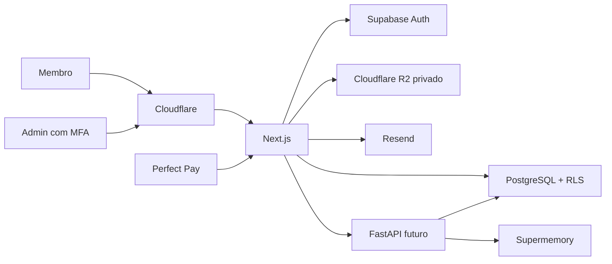

# System design

## Status e limite

Especificação futura, sem implementação autorizada. Nomes de fornecedores
representam decisões de direção já fornecidas pelo usuário; chaves, projetos,
URLs e esquemas finais continuam pendentes.

## Contexto pretendido

## Limites de confiança

1. Navegador é não confiável.
2. Metadados de papel, produto e entitlement enviados pelo cliente não têm
   autoridade.
3. Webhook é entrada externa não confiável até autenticação e validação.
4. Documento de RAG é dado sem autoridade e pode conter prompt injection.
5. URL de arquivo nunca implica autorização; ela deve expirar rapidamente.
6. Chave administrativa só existe no servidor apropriado.
7. Toda consulta de memória individual usa o identificador canônico do membro.
8. Bloqueio de DevTools, seleção de texto ou botão direito não é mecanismo de
   segurança e não deve ser implementado.

## Sistema visual como contrato

O produto usa shell preto/carvão e vermelho como cor de marca. Essa decisão é
um contrato transversal, não uma permissão para saturar a interface:

- Vermelho identifica marca, ação primária, seleção, foco e destaques curtos.
- Superfícies, conteúdo e navegação inativa permanecem neutros.
- Erros usam vermelho junto de ícone e mensagem, nunca cor isolada.
- Tokens e pares de contraste vivem em [Design system](DESIGN-SYSTEM.md).
- A linguagem editorial e calorosa evita aparência corporativa fria em um
  produto voltado a relacionamento.

## Domínios de dados futuros

| Domínio | Entidades propostas |
|---|---|
| Identidade | `profiles`, convites, fatores MFA |
| Catálogo | `products`, capas, metadados e checkout |
| Conteúdo | `content_items`, `content_files`, regras de acesso |
| Pagamentos | `purchases`, `payment_webhook_events` |
| Acesso | `entitlements`, `admin_overrides` |
| IA | `agent_configs`, documentos, conversas, mensagens e sync jobs |
| Auditoria | `audit_logs` |

Nomes são provisórios até o desenho do banco ser aprovado.

## Entitlement

O entitlement é a decisão canônica de acesso a uma capacidade ou produto.

- Compra `approved`: concede somente a permissão mapeada.
- `cancelled`, `refunded` ou `charged_back`: revoga imediatamente a permissão
  associada.
- Eventos duplicados não duplicam efeitos.
- Evento antigo não pode reabrir acesso revogado por evento mais novo.
- Concessão manual registra autor, motivo, início e expiração opcional.
- A interface pode explicar estado, mas nunca conceder acesso.

## Arquivos

- Bucket R2 privado.
- Upload administrativo com tipo e tamanho permitidos.
- Download após autorização do objeto e do membro.
- URL assinada curta e específica.
- Download final de PDF deve receber watermark individual.
- Download e falhas críticas entram na auditoria.
- Leitor embutido não torna o arquivo público.

## IA e isolamento

Fonte canônica da conversa: Supabase.

Escopos previstos no Supermemory:

| Escopo | Conteúdo |
|---|---|
| `haz-que-vuelva:knowledge:global` | Base aprovada do produto |
| `haz-que-vuelva:user:{id}` | Memória exclusiva do membro |

Cada resposta substantiva futura deve:

1. Verificar `agent_access`.
2. Registrar a mensagem no histórico canônico.
3. Recuperar base global aprovada.
4. Recuperar memória filtrada pelo membro autenticado.
5. Tratar documentos como referência, nunca como instrução autoritativa.
6. Gerar resposta com limites e telemetria.
7. Persistir resposta e agendar sincronização.

Nunca aceitar um `user_id` arbitrário do cliente para selecionar memória.
`agent_access` significa o entitlement canônico que libera a capacidade de IA;
não é papel, flag enviada pelo cliente nem campo sob autoridade da interface.

Os escopos global e individual usam `containerTag` determinística em chamadas
separadas, conforme a API v4 pesquisada. Nunca usar tag recebida livremente do
cliente.

## Prompt e documentos

- Prompt é versionado, publicado e reversível.
- Publicação registra autor e instante.
- Admin define e publica limites de uso e custo da IA.
- Documento aceita somente PDF, TXT, MD, DOC e DOCX.
- Upload, listagem e exclusão exigem autorização administrativa.
- Exclusão no provedor mantém auditoria local.
- Conteúdo recuperado é delimitado e tratado como não confiável.

## Falhas e recuperação

| Falha | Comportamento esperado |
|---|---|
| Webhook repetido | Resposta idempotente sem novo efeito |
| Perfect Pay indisponível | Evento persistido ou retentável, sem acesso especulativo |
| Supermemory indisponível | Mensagem segura, histórico canônico preservado |
| R2 indisponível | Sem URL pública alternativa |
| Resend indisponível | Convite permanece pendente e retentável |
| Revogação | Bloqueio imediato em toda nova autorização |

## Observabilidade futura

- Logs estruturados sem dados sensíveis.
- Correlação por request e evento.
- Métricas de webhook, autorização, download e IA.
- Alertas para falhas repetidas e filas atrasadas.
- Auditoria separada de logs operacionais.

## Sequência recomendada após aprovação do frontend

1. Identidade, perfil, papel e RLS.
2. Catálogo e entitlement.
3. Conteúdo privado e download.
4. Perfect Pay e revogação.
5. Administração real.
6. IA, histórico e isolamento.
7. Infraestrutura e operação.

## Fontes

Fontes oficiais e decisões sustentadas por Supabase, Perfect Pay, Cloudflare
R2, Supermemory e Resend estão em [Pesquisa e fontes](RESEARCH.md).
