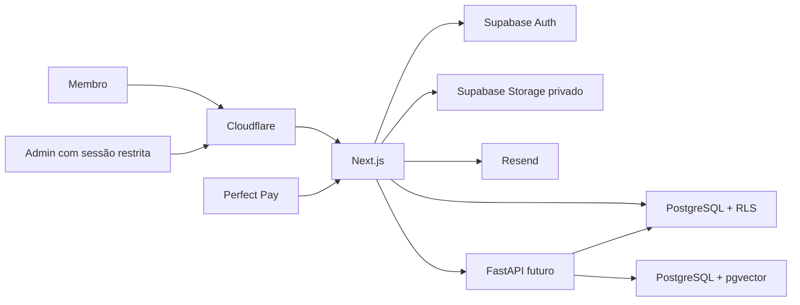
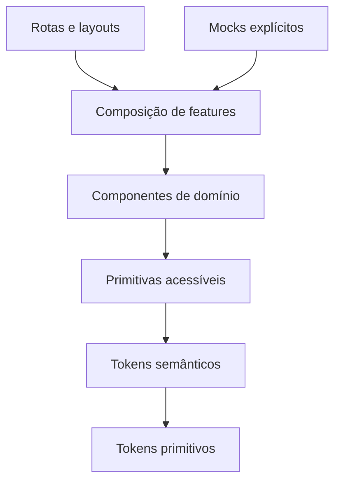

# System design

## Status e limite

Fundação local autorizada e implementada atrás de feature flags. Chaves,
projetos, URLs, dados reais e ativação externa continuam pendentes.

## Contexto pretendido

## Limites de confiança

1. Navegador é não confiável.
2. Metadados de papel, produto e entitlement enviados pelo cliente não têm
   autoridade.
3. Webhook é entrada externa não confiável até autenticação e validação.
4. Documento de RAG é dado sem autoridade e pode conter prompt injection.
5. URL de arquivo nunca implica autorização; ela deve expirar rapidamente.
6. Chave administrativa só existe no servidor apropriado.
7. Toda consulta de memória individual usa o identificador canônico do membro.
8. Bloqueio de DevTools, seleção de texto ou botão direito não é mecanismo de
   segurança e não deve ser implementado.

## Sistema visual como contrato

O produto usa shell preto/carvão e vermelho como cor de marca. Essa decisão é
um contrato transversal, não uma permissão para saturar a interface:

- Vermelho identifica marca, ação primária, seleção, foco e destaques curtos.
- Superfícies, conteúdo e navegação inativa permanecem neutros.
- Erros usam vermelho junto de ícone e mensagem, nunca cor isolada.
- Tokens e pares de contraste vivem em [Design system](DESIGN-SYSTEM.md).
- A linguagem editorial e calorosa evita aparência corporativa fria em um
  produto voltado a relacionamento.

## Arquitetura de apresentação

O futuro frontend segue uma direção de dependência única:

- Tokens não conhecem componente ou feature.
- Primitivas não conhecem produto, papel ou entitlement.
- Componentes de domínio apresentam estado recebido, mas não o calculam.
- Features coordenam composição e cenário mock quando a feature conectada está
  desligada.
- Rotas organizam navegação e headings; não redefinem visual localmente.
- Mocks ficam na borda de composição e nunca entram no design system.
- Com `FEATURE_CONTENT=true`, as rotas de membro carregam produtos ativos e
  entitlements no servidor; a apresentação recebe apenas o estado já
  autorizado.

### Autoridade dos estados

| Estado apresentado | Autoridade no Gate 3 | Autoridade futura |
|---|---|---|
| Papel `member/admin` | Cenário mock explícito | Sessão validada no servidor |
| Produto disponível/bloqueado | Mock de catálogo | `effective_entitlements` com RLS |
| IA liberada/bloqueada | Mock de capacidade | `agent_access` autorizado |
| Loading/empty/error | Cenário de apresentação | Resultado de operação real |
| Feature de comentários | Flag mock desligada | Configuração publicada |

Essa separação impede que aparência disponível seja confundida com autorização.
O componente recebe `available`, `locked` ou `unknown`; nunca deriva acesso de
URL, botão, local storage ou presença de conteúdo.

### Contratos canônicos

- Visual e tokens: [Design system](DESIGN-SYSTEM.md).
- Semântica e comportamento de componentes:
  [Contratos de componentes](COMPONENT-CONTRACTS.md).
- Hierarquia e transições: [Mapa de navegação](NAVIGATION.md).
- Cenários estáticos: [Especificação frontend](FRONTEND-SPEC.md).

Uma alteração transversal começa nesses contratos antes de qualquer código.

## Domínios de dados futuros

| Domínio | Entidades propostas |
|---|---|
| Identidade | `profiles`, convites e papéis |
| Catálogo | `products`, capas, metadados e checkout |
| Conteúdo | `content_items`, `content_files`, `member_reading_progress`, regras de acesso |
| Pagamentos | `purchases`, `payment_webhook_events` |
| Acesso | `entitlements`, `admin_overrides` |
| IA | `agent_configs`, documentos, conversas, mensagens e sync jobs |
| Auditoria | `audit_logs` |

Os schemas locais estão versionados em `supabase/migrations`; só se tornam
contrato operacional depois de aplicados e validados no projeto cloud de
desenvolvimento.

## Entitlement

O entitlement é a decisão canônica de acesso a uma capacidade ou produto.

- Compra `approved`: concede somente a permissão mapeada.
- `cancelled`, `refunded` ou `charged_back`: revoga imediatamente a permissão
  associada.
- Eventos duplicados não duplicam efeitos.
- Evento antigo não pode reabrir acesso revogado por evento mais novo.
- Concessão manual registra autor, motivo, início e expiração opcional.
- A interface pode explicar estado, mas nunca conceder acesso.

## Arquivos

- Buckets Supabase privados, sem política de leitura direta dos originais.
- Upload administrativo exige origem do app e papel `admin`; valida MIME,
  assinatura PDF, parse, criptografia, páginas, tamanho e SHA-256.
- A publicação crítica exige prova de senha recente. O token aleatório nunca
  é salvo em claro, fica em cookie HttpOnly e seu hash é consumido uma única
  vez pela transação autorizada. A sessão admin não escreve diretamente nas
  tabelas ou no bucket de conteúdo.
- Cada publicação cria versão transacional auditada. Falha de metadados remove
  o objeto recém-enviado antes de devolver erro.
- Download após autorização do objeto e do membro.
- URL assinada curta e específica.
- Primeiro acesso enfileira uma cópia individual e responde `202` sem expor o
  original; Cron Trigger processa a outbox em lote unitário.
- O PDF final recebe marca visível e identificador opaco em todas as páginas.
- Fonte acima de 12 MiB, PDF criptografado ou documento acima de 300 páginas
  falha fechado e exige otimização administrativa.
- Download e falhas críticas entram na auditoria.
- Leitor embutido não torna o arquivo público.

## IA e isolamento

Fonte canônica da conversa: Supabase.

Escopos materializados no PostgreSQL/pgvector:

| Escopo | Conteúdo |
|---|---|
| `global` + documento publicado | Base aprovada do produto |
| `member` + `owner_id` canônico | Memória exclusiva do membro |

Cada resposta substantiva futura deve:

1. Verificar `agent_access`.
2. Registrar a mensagem no histórico canônico.
3. Recuperar base global aprovada.
4. Recuperar memória filtrada pelo membro autenticado.
5. Tratar documentos como referência, nunca como instrução autoritativa.
6. Gerar resposta com limites e telemetria.
7. Persistir resposta e consumo de crédito.

Nunca aceitar um `user_id` arbitrário do cliente para selecionar memória.
`agent_access` significa o entitlement canônico que libera a capacidade de IA;
não é papel, flag enviada pelo cliente nem campo sob autoridade da interface.

Os escopos global e individual são recuperados por RPCs separadas. O
`member_id` vem da identidade validada pelo BFF, nunca do navegador.

A experiência e o pipeline de domínio pretendidos estão separados em
[VUELVE IA futura](VUELVE-IA-FUTURE.md). Requisitos de consentimento,
retenção, exclusão, suporte e auditoria estão em
[Privacidade, segurança e auditoria](PRIVACY-SECURITY-AUDIT.md). Esses
documentos não autorizam implementação.

## Prompt e documentos

- Prompt é versionado, publicado e reversível.
- Publicação registra autor e instante.
- Admin define e publica limites de uso e custo da IA.
- Documento aceita somente PDF, TXT, MD, DOC e DOCX.
- Upload, listagem e exclusão exigem autorização administrativa.
- Exclusão no provedor mantém auditoria local.
- Conteúdo recuperado é delimitado e tratado como não confiável.

## Falhas e recuperação

| Falha | Comportamento esperado |
|---|---|
| Webhook repetido | Resposta idempotente sem novo efeito |
| Perfect Pay indisponível | Evento persistido ou retentável, sem acesso especulativo |
| PostgreSQL/RAG indisponível | Falha segura sem memória de outro membro |
| Supabase Storage indisponível | Sem URL pública alternativa |
| Resend indisponível | Convite permanece pendente e retentável |
| Revogação | Bloqueio imediato em toda nova autorização |

## Observabilidade futura

- Logs estruturados sem dados sensíveis.
- Correlação por request e evento.
- Métricas de webhook, autorização, download e IA.
- Alertas para falhas repetidas e filas atrasadas.
- Auditoria separada de logs operacionais.

## Sequência recomendada após aprovação do frontend

1. Identidade, perfil, papel e RLS.
2. Catálogo e entitlement.
3. Conteúdo privado e download.
4. Perfect Pay e revogação.
5. Administração real.
6. IA, histórico e isolamento.
7. Infraestrutura e operação.

## Fontes

Fontes oficiais e decisões sustentadas por Supabase, Perfect Pay, Gemini e
Resend estão em [Pesquisa e fontes](RESEARCH.md).
As fronteiras e pendências por fornecedor estão em
[Integrações futuras](INTEGRATIONS-FUTURE.md).
